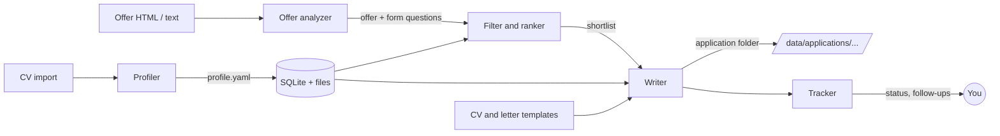

# Paul (Emploi)

> Self-hosted, open-source assistant that helps you **apply to more jobs, and apply better**.
> Paste an offer, get a ranked shortlist, a tailored CV and cover letter in *your own template*, answers to the application form, and a tracker to follow it all.

---

## Table of contents

1. [Why](#why)
2. [Principles](#principles)
3. [Features](#features)
4. [Quick start](#quick-start)
5. [How it works](#how-it-works)
6. [Modules in detail](#modules-in-detail)
7. [Template import](#template-import)
8. [Data and privacy](#data-and-privacy)
9. [Tech stack and project layout](#tech-stack-and-project-layout)
10. [Configuration](#configuration)
11. [Roadmap](#roadmap)
12. [Non-goals](#non-goals)
13. [Contributing](#contributing)

---

## Why

Applying seriously means repeating the same loop dozens of times: read the offer, decide if it is worth it, adapt the CV, write a cover letter, answer the form questions, remember what was sent, follow up. Most of it is mechanical, and each step is a chance to make mistakes or give up.

Paul automates the mechanical parts with an LLM **while keeping you in control**: everything is generated from a profile you own and can edit, every output is reviewed by you, and nothing is ever sent automatically.

## Principles

- **Local first.** Runs on your machine. Your profile, offers and documents never leave it, except the text sent to the LLM provider you configure.
- **Bring your own key.** Any LLM provider (OpenAI, Anthropic, Mistral, Ollama, ...) through a single API key or a local endpoint.
- **No invented facts.** Generated documents may only use what is in your profile. A verification pass flags anything unsupported.
- **Human in the loop.** Review and edit before every export. No auto-apply, no scraping behind a login.
- **Plain files.** Profile in YAML, applications in folders of Markdown/DOCX. You can read, back up and version everything without the app.
- **Small and readable.** One process, one database file, no front-end build step.

## Features

| Module | What it does |
|---|---|
| **Profiler** | Imports your CV, interviews you to fill the gaps, and builds a detailed, editable profile. |
| **Offer analyzer** | Paste the **raw HTML fragment** of an offer (description + application form), or plain text. The agent extracts structured data and the form questions. |
| **Filter and ranker** | Eliminates offers that break your rules and scores the others against your profile and your wishes, with a one-sentence justification. |
| **Writer** | Produces a tailored CV and cover letter **in your imported template**, drafts answers to the form questions, and computes a keyword-coverage (ATS) score. |
| **Tracker** | A table of all offers and their status, with follow-up reminders. Mailbox reading comes after the MVP. |
| **Settings** | LLM provider, model and API key, follow-up delay, output language. |

## Quick start

Requirements: Docker with Compose.

```bash
git clone https://github.com/thomassimmer/paul-emploi.git
cd paul-emploi
docker compose up
```

Then open <http://localhost:8000>, go to **Settings**, choose a model and paste your API key. The first-run wizard walks you through importing your CV.

The app is bound to `127.0.0.1` only. Your data lives in `./data`, which is mounted as a volume, so it survives updates (`git pull && docker compose up --build`).

### Without Docker (development)

```bash
python -m venv .venv && . .venv/bin/activate
pip install -e ".[dev]"
uvicorn app.main:app --reload
pytest
```

## How it works



Typical session:

1. **Once:** import your CV, answer the profiler's questions, import your CV and letter templates, write your filter rules and wishes.
2. **Per offer:** paste the HTML fragment. The offer is analyzed, filtered and scored in seconds.
3. **For the best matches:** click *Prepare application*. Review the generated CV, letter and answers, fix what you want, export, apply on the company site.
4. **Afterwards:** update the status in the tracker; get reminded when a follow-up is due.

## Modules in detail

### 1. Profiler

**Input:** an existing CV (PDF or DOCX), or its text pasted in.

1. **Extraction (deterministic).** Text is read locally (`pypdf`, `python-docx`), and the raw text is kept in `data/profile/cv.txt` so the draft can be re-run later with a better model.
2. **First draft (LLM, structured output).** The model fills a `ProfileDraft`, which deliberately has **no** `facts` and **no** `preferences` fields: those are yours to answer, and the type makes it impossible for the model to invent them. Facts and preferences are also preserved when you re-import a CV.
3. **Interview.** Paul asks **one question at a time**, targeting what a CV usually omits: what the company was, your exact remit, team size, the stack you really used, measurable results, the hard problems, then the facts and what you want more or less of. The questions are computed by code from your profile, not by the LLM, so the same profile always yields the same questions; a skipped question is remembered in SQLite and can be brought back.
4. **Answer structuring (LLM, optional).** When an answer describes results and a model is configured, the model splits it into achievements with their `metrics` and `skills`. It is never trusted blindly: each item must quote the excerpt of your answer it came from, and it may not state a number your answer does not contain. A breakdown that fails either check is discarded whole and your own lines are kept as written, one achievement per line. Nothing is ever added to what you wrote.
5. **Editable profile.** Correct anything in the structured editor, or directly as YAML. You can also edit the file by hand at any time.

**Storage:** `data/profile/profile.yaml`, a single readable file, next to the extracted `cv.txt`.

```yaml
identity:
  name: ...
  location: ...
  links: [...]
facts:                     # answered by you, never by the LLM
  work_authorization: ...
  notice_period: ...
  salary_expectation: ...
  languages: [...]
experiences:
  - id: exp-acme-2022
    company: Acme
    title: Lead Software Engineer
    period: 2022-03 / 2024-06
    context: ...           # what the company and the role were
    team_size: 7 engineers
    stack: [Rust, Kafka]
    difficulties: ...
    achievements:
      - id: exp-acme-2022-a1
        text: Cut ingestion latency by 60% by ...
        metrics: ["60%"]
        skills: [Rust, Kafka]
education: [...]
projects: [...]
skills: {Languages: [Rust], Tools: [Kafka]}
preferences:
  more_of: [...]
  less_of: [...]
```

Every experience and achievement has a stable `id` (`exp-acme-2022`, `exp-acme-2022-a1`), derived from its content so that a re-import does not churn the ids. The writer cites these ids, which is what makes the fact-checking pass possible. A complete fictional example lives in `app/examples/profile.example.yaml`.

### 2. Offer analyzer

**Input (any combination):**

- the **HTML fragment** of the offer page: description *and* application form (recommended, this is the main path),
- plain text pasted from the page,
- several fragments for the same offer (e.g. description and form on different pages). Duplicated lines across fragments are collapsed.

**How to get the fragment:** open the offer, right-click the relevant block, *Inspect*, right-click the element, *Copy outerHTML*, paste it into Paul. Content loaded in another frame, or behind another click, has to be pasted separately.

**Processing:**

1. **Cleaning (deterministic).** `BeautifulSoup` drops scripts, styles, SVG, images, hidden elements and tracking parameters, and keeps what matters: headings, lists, paragraphs and links (rendered as Markdown). Form controls are parsed here too, into `label`, `name`, `type`, `required`, `maxlength`, `placeholder` and `<option>` values, with radio and checkbox groups merged by `name` and named by their `<legend>`. This keeps token usage low and makes extraction reliable.
2. **Extraction (LLM, structured output).** The cleaned **description** is turned into a validated Pydantic object:

```text
Offer
├── title, company, location, remote policy, contract type, seniority
├── salary (if present), language of the offer
├── responsibilities
├── requirements: must-have / nice-to-have
├── keywords (with the variants the text itself uses)
├── constraints: work authorization, citizenship, on-site, language level, clearance
├── company info found in the text (size, funding, domain, mission)
└── application form          <- parsed from the markup by code, not by the LLM
    └── questions: label, type, options, required, max length
```

The application form is deliberately *not* asked for from the model: labels, `required`, `maxlength` and option values are facts sitting in the markup, so they are read by code (cheaper, and never approximated). Form controls are therefore left out of the text sent to the model.
3. **Storage.** The offer is saved in SQLite as JSON, next to the raw fragment and the cleaned text, so you can re-run the analysis later with a better model or a tighter prompt without pasting the page again.

Nothing is invented: a field the offer does not state stays empty. Company facts are only recorded when the pasted text mentions them. If the extraction fails validation it is retried once with the error message, and whatever could not be read is listed on the offer page and can be completed by hand.

### 3. Filter and ranker

Two stages, both run by the LLM against structured data.

**Stage 1: elimination.** You write natural-language rules once, for example:

> Eliminate offers that explicitly require citizenship, a security clearance, or an existing work permit.
> Eliminate offers requiring fewer than 3 or more than 10 years of experience.

The agent returns, per offer: `eliminated: true/false` and the exact excerpt that triggered the rule. Nothing disappears silently: eliminated offers stay visible with the reason and can be restored.

**Stage 2: scoring.** For the remaining offers, the LLM fills a fixed grid, returned as JSON:

| Axis | Source |
|---|---|
| Technical match | requirements vs. profile skills and achievements |
| Seniority and scope | responsibilities vs. experience |
| Your wishes | your weighted criteria, e.g. *startup, funded, scientific domain, remote* |
| Red flags | vague role, unrealistic requirements, contradictions |

Each axis has a score, a weight and a one-line justification; the total is computed by code, not by the LLM. The result is explainable and stable across runs. Company facts (funding, domain) are only known if they appear in the pasted content: the ranker says "unknown" rather than guessing.

### 4. Writer

For an offer you pick, Paul builds an **application folder** containing:

```text
data/applications/2026-09-acme-senior-backend/
├── offer.json          # structured offer
├── offer.html          # raw fragment as pasted
├── cv.md               # editable source of the CV
├── cv.docx             # rendered in your template
├── letter.md
├── letter.docx
├── answers.md          # form questions and drafted answers
├── ats.json            # keyword coverage report
└── notes.md            # your notes, interview prep
```

**Tailoring.** The writer selects and orders the most relevant experiences and achievements from your profile, rephrases them with the offer's vocabulary, and writes a letter grounded in the company and the role. Documents are generated in the **language of the offer** (or the one you force in settings).

**No invented facts.**

- The prompt only allows content from the profile and requires each statement to cite an achievement `id`.
- A second pass (*grounding check*) compares every line of the output to the profile and flags unsupported claims, which are highlighted in the review screen.
- Factual form questions (work authorization, salary expectation, notice period, relocation, ...) are answered **from the `facts` section of your profile**, never generated. If the fact is missing, the field is left empty for you.

**Form answers.** Open questions ("Why do you want to join us?") get a draft that respects the max length, using your profile and the offer.

**Review screen.** Side-by-side preview and editor for CV, letter and answers; regenerate a section with an instruction ("shorter", "more focus on data engineering"). Then export.

**ATS score.** There is no universal ATS score: ATS (*Applicant Tracking System*, e.g. Workday, Greenhouse, Lever) is the software companies use to receive and sort applications, and vendors' "scores" are in practice keyword coverage. Paul does the same, transparently:

1. The LLM extracts the important keywords from the offer, with accepted variants (`K8s` / `Kubernetes`).
2. Plain code checks their presence in the final CV text (normalized, accent- and case-insensitive).
3. You get a **coverage percentage and the list of missing keywords**, each with a hint on whether your profile supports adding it truthfully.
4. **Format checks** on the DOCX: text boxes, images holding text, multi-column layouts and tables used for layout are flagged, since some parsers handle them poorly.

Treat it as an indicator, not a guarantee.

### 5. Tracker

A single HTML page with a sortable, filterable table:

| Column | Content |
|---|---|
| Company / role | link to the application folder |
| Score | total, with the breakdown on hover |
| Status | `Analyzed` → `Shortlisted` → `Ready` → `Applied` → `Interview` → `Offer` / `Rejected` / `No response` |
| Dates | analyzed, applied, last contact |
| Follow-up | highlighted when *N days* (configurable, default 7) have passed since `Applied` without news |
| Notes | free text |

Statuses are changed by hand in the MVP. **After the MVP:** one click reads your mailbox over **IMAP with an app password** (no OAuth setup), matches messages to applications, proposes status updates (acknowledgment, interview, rejection) and asks you to confirm.

### 6. Settings

- LLM provider, model, API key or local endpoint (through LiteLLM), with a "test connection" button
- Output language (auto / fixed)
- Follow-up delay
- Filter rules and weighted wishes (edited in the ranker page, stored with the settings)

## Template import

Your CV and letter should look like *you*, not like a generic export. Paul learns from **your own templates**.

### What you provide

A CV and a cover letter as `.docx` files, ideally a previous version you are happy with. They are imported separately and stored in `data/templates/`.

### What is captured

Structure, colors, fonts, page setup and decorative elements, all read directly from the file:

- page size and margins, headers and footers, column layout (including two-column layouts built with tables)
- fonts, sizes, colors, spacing, bullet styles, borders and shading, theme colors
- the **order of sections** and how each kind of content is styled

### How it is reused

1. **Analysis.** A parser walks the document and groups its content into blocks. One LLM call then assigns each block a **role**:

   `name`, `headline`, `contact`, `section_title`, `entry_title`, `entry_subtitle`, `entry_dates`, `bullet`, `body_text`, `skill_line`, `recipient`, `date`, `salutation`, `closing`, `signature`, or `fixed` (logo, decorative line, footer: kept untouched).

2. **Blueprint.** The result is saved as `template.json` and shown as a preview where you can correct any wrongly detected role.
3. **Rendering.** The original DOCX is used as the base. For each role, one existing block acts as a **prototype**: its XML (run formatting, numbering, borders, shading) is deep-copied and filled with the new text, and the sample content is removed. A section missing from the template (e.g. *Projects*) is created by cloning a section title and an entry prototype. Because the file itself is the base, fonts, colors and layout are preserved exactly, rather than approximated.
4. **Fit check.** The document is converted to PDF to count pages. If it overflows the target length, the writer condenses the content (shorter bullets, fewer old items) and re-renders, up to two times.

If you provide no template, a clean, single-column, parser-friendly default is used.

### Limitations

- Templates built from text boxes, floating shapes or images of text may be only partially understood; the preview tells you what was detected.
- A **PDF** template (e.g. exported from Canva) cannot be edited in place. In that case only the *look* (fonts, colors, section order) is extracted and applied to the default template. This is an approximation and is labeled as such.
- Exotic Word features may not survive; report them with an anonymized sample file.

### Exports

- **DOCX** (always) and **Markdown** (always).
- **PDF** through headless LibreOffice, included in the Docker image (larger image, about 500 MB). Build without it with `docker compose build --build-arg WITH_PDF=0`; the fit check then falls back to an estimate.

## Data and privacy

- All data is stored under `./data` (git-ignored): profile, database, templates, application folders, settings.
- The API key is stored in `data/settings.json` on your machine. Do not commit or share this folder.
- What is sent to the LLM provider: profile excerpts, offer content and your rules. Use a local model (Ollama) if that is a concern.
- The web UI has no authentication because it is bound to `127.0.0.1`. Do not expose the port to a network.
- Pasted HTML is parsed as data and never executed. Since the content comes from third-party pages, the prompts treat it as untrusted text and ignore instructions embedded in it.

## Tech stack and project layout

**Stack:** Python 3.12, FastAPI, Jinja2 + HTMX (no front-end build), SQLite, Pydantic, LiteLLM, BeautifulSoup, `python-docx`, `pypdf`, Docker Compose.

```text
paul-emploi/
├── docker-compose.yml
├── Dockerfile
├── pyproject.toml
├── README.md
├── app/
│   ├── main.py                # composition root: app, lifespan, routers
│   ├── config.py              # settings load/save
│   ├── db.py                  # SQLite access
│   ├── llm.py                 # LiteLLM wrapper, structured output + retry
│   ├── models.py              # Pydantic models: Profile, Offer, Score, Application
│   ├── prompts/               # prompts as plain text files
│   │   ├── offers/
│   │   └── profiler/
│   ├── profiler/              # CV import, interview, editable profile
│   │   ├── cv.py              # PDF/DOCX text extraction
│   │   ├── draft.py           # LLM: CV text -> ProfileDraft
│   │   ├── editor.py          # structured profile form <-> Profile
│   │   ├── ids.py             # stable ids (exp-acme-2022-a1)
│   │   ├── interview.py       # gap-driven questions, answer merge
│   │   ├── router.py          # HTTP routes
│   │   ├── service.py         # import orchestration
│   │   ├── store.py           # profile.yaml, cv.txt, interview state
│   │   └── text.py            # list, metric and text helpers
│   ├── offers/                # offer analyzer
│   │   ├── clean.py           # deterministic HTML cleaning + form parsing
│   │   ├── editor.py          # structured offer form <-> Offer
│   │   ├── extract.py         # LLM: cleaned text -> OfferDraft
│   │   ├── router.py          # HTTP routes
│   │   ├── service.py         # analysis orchestration
│   │   └── store.py           # offers in SQLite (raw + cleaned kept)
│   ├── ranking/               # elimination rules, scoring grid
│   ├── writer/                # tailoring, grounding check, form answers
│   ├── ats.py                 # keyword coverage and format checks
│   ├── templates_engine/      # DOCX analysis, blueprint, rendering
│   ├── tracker/               # statuses, follow-ups, (later) IMAP
│   ├── web/                   # presentation layer
│   │   ├── templating.py      # Jinja env, render/redirect/flash helpers
│   │   ├── routes/            # dashboard, settings
│   │   ├── templates/         # Jinja templates
│   │   └── static/            # CSS, vendored HTMX
│   └── examples/              # fictional profile, sample templates
├── tests/
└── data/                      # git-ignored, mounted as a volume
```

Design rules: prompts live in files, not in code; every LLM call returns a validated Pydantic object; anything that can be computed by code (totals, keyword matching, follow-up dates, interview questions) is not left to the LLM.

Conventions: each feature package owns its HTTP routes (`app/profiler/router.py`) and keeps them thin, delegating to its own modules; the shell routes live in `app/web/routes/` and `app/main.py` only wires routers together.

## Configuration

| Setting | Default | Description |
|---|---|---|
| `model` | none | LiteLLM model string, e.g. `anthropic/claude-sonnet-4-5`, `openai/gpt-4o`, `ollama/llama3` |
| `api_key` | none | Provider key (not needed for local models) |
| `api_base` | none | Custom or local endpoint |
| `output_language` | `auto` | `auto` follows the offer; or `en`, `fr`, ... |
| `followup_days` | `7` | Days without news before a follow-up is suggested |
| `target_pages` | `2` (CV), `1` (letter) | Used by the fit check |

## Roadmap

**MVP**

- [x] Docker Compose install, settings page
- [x] Profiler: CV import, interview, editable profile
- [x] Offer analyzer: HTML fragment and text, form question extraction
- [ ] Filter and ranker with explainable scores
- [ ] DOCX template import and rendering (CV and letter)
- [ ] Writer with grounding check, form answers, ATS coverage
- [ ] Tracker with manual statuses and follow-up reminders

**Next**

- [ ] IMAP mailbox reading and status suggestions
- [ ] Fetch an offer from a URL (best effort; many sites need JavaScript or a login)
- [ ] PDF template look extraction improvements
- [ ] Interview preparation sheet per application
- [ ] Import/export of the whole workspace
- [ ] Multiple profiles (e.g. one per target role)

## Non-goals

- **No automatic submission** of applications, and no bots filling forms on your behalf: this violates most sites' terms and produces poor applications.
- **No scraping behind a login** (LinkedIn and similar). You paste what you see.
- **No hosted version or accounts.** Local tool only.
- **No guarantee on ATS behavior.** The score is a keyword indicator.

## Contributing

Issues and pull requests are welcome. Please keep the code small and readable, add a test for new behavior, and never include real personal data in examples or bug reports (use the fictional profile in `app/examples/`).

## License

MIT (suggested, adjust as you prefer).
