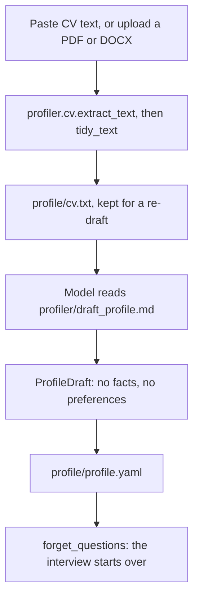
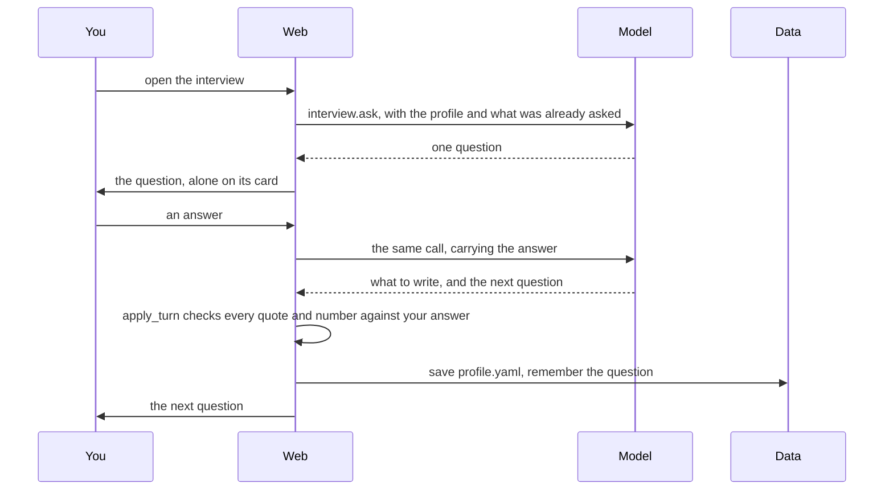
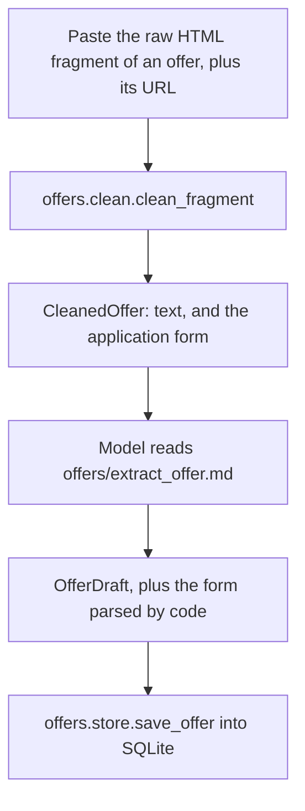
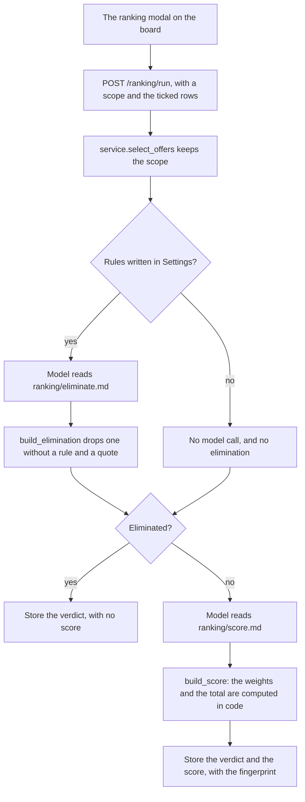
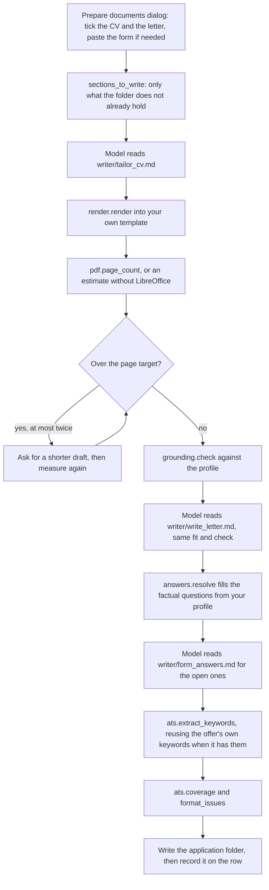
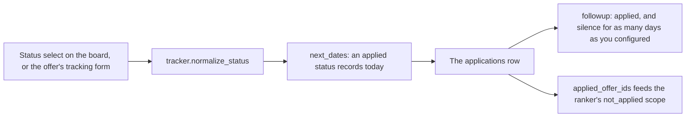

# The flows

Five flows carry the whole application. Read them in this order: they go from the
one-off setup to the per-offer loop, and each one introduces a piece the next
assumes.

Two conventions throughout:

- **`Model`** marks the only steps where an LLM is called. Everything else is code,
  and that is the point of the architecture: the model writes prose and answers
  judgement questions, code decides what is true, what is stored and what is shown.
- Every model call goes through `app.llm.complete_structured`, which returns a
  validated Pydantic object and retries once with the validation error when the
  model answers something invalid. The prompt is a Markdown file under `app/prompts/`
  (overridable, see the README), the schema is JSON Schema generated from the model.

## 1. Onboarding — import a CV, then answer questions

Once. Everything else is per offer.

`ProfileDraft` deliberately has no `facts` and no `preferences`. Those are answers
only you can give, and the _type_ makes it impossible for an import to invent a
notice period. A re-import copies the existing ones back over the fresh draft.

The interview is where the profile grows:

Three things about that loop are worth noticing, because they explain the shape of
`app/profiler/interview.py`:

- **Nothing about the next question is stored.** It is computed from the profile as
  it stands, every time. That is what lets you stop and come back days later: the
  interview resumes from the profile, not from a saved cursor. The only thing
  persisted is what was already _asked_ (`interview_asked` in SQLite), or the model
  would start from the same first gap on every visit.
- **One model call per answer.** The call that writes your answer down is the call
  that asks the next question, so an exchange is one round trip.
- **A write-up that fails verification is dropped, and the question is not marked as
  asked.** Every change the model proposes must quote the answer it came from, and
  every number in the value is checked against that answer. Otherwise the question
  comes back — you only have the page to rephrase what was lost.

Merging follows the field, and the code decides: a list gains the items it lacked,
free text gains a line, and a fact is _corrected_ rather than accumulated ("1 month",
then "2 months" means two months). Nothing is dropped, except a highlight the model
explicitly marked as superseded by the line it was merged into.

## 2. Analyze an offer

Per offer, and the entrance to everything else.

`clean_fragment` is where the trust boundary is. The pasted fragment is third-party
markup: scripts, styles, SVG and tracking parameters are dropped, and what survives
becomes a compact Markdown-ish text. **The model never sees raw page HTML.**

The application form is parsed from the markup _by code_, not asked of the model
(`app/offers/clean.py`): labels, `name`, `type`, `required`, `maxlength`,
`placeholder` and `<option>` values are facts of the HTML, and reading them in code
is both more faithful and cheaper than a model pass. `OfferDraft` has no `form`
field at all, and `Offer` is `OfferDraft` plus the form code filled in.

The cleaning and the form parsing happen in the HTTP request, where a failure is
cheap to report on the page; the model call and the save run in the background, and
the board polls `/progress/analyze` — so the offer appears in the table the moment
it is stored, and you can paste the next one while this one is still being read.

The notice under the analysis lists what could not be read: a truncated fragment, no
form found, a missing title or seniority. The raw fragment and the cleaned text are
both stored, so **`Re-analyze`** later re-runs the extraction, with a better model,
from `cleaned` — and carries the parsed form over untouched, because the markup it
came from is gone.

## 3. Rank

Two stages, and only the first can eliminate.

**Stage 1 — elimination** can only use a rule _you_ wrote, and only with the passage
that triggered it quoted back. An elimination missing either is downgraded to
nothing in code, so an offer never disappears without a reason you can read. With no
rules written, no model call is made at all.

**Stage 2 — scoring** fills a fixed four-axis grid, and each axis carries its own
justification. The weights (40 / 20 / 25 / 15) and the total are computed in code:
if the model chose the weights, an identical offer would score differently between
runs for invisible reasons. The total is `0-100`, and you can disagree with a single
line of it.

Every stored verdict carries a **fingerprint** — a hash of the model, the rules, the
wishes, the text of the two ranking prompts, the profile and the offer. It is what
makes _out of date_ detectable without asking the model: change any of those and
`service.is_stale` returns true, the board tags the offer _out of date_, and the
`pending` scope picks it up again. A manual override (`kept` / `eliminated`) wins
over the rules and survives a re-run.

The run itself is a background job over a bounded pool of calls
(`app/ranking/jobs.py`), with a per-offer report the board polls. A model failure
touches nothing: the offer stays in `pending` and is simply retried next time,
rather than being silently left unscored.

## 4. Prepare the documents

The long one: three model calls, a page measurement, two verification passes.

**Sections, not documents.** `sections_to_write` reads the folder and writes only
what is missing. Reopening the dialog because new form questions came up must not
throw away the CV and the letter that are already there, and a section you did not
tick is left exactly as it is on disk — never erased.

**Your template stays the base.** `render.render` keeps your DOCX, clears its body
and re-emits each line as a deep copy of the template paragraph it was modelled on,
so page size, margins, styles, theme, headers and footers — and the fonts, colours,
numbering and hyperlinks of every line — are preserved rather than approximated.

**The fitting loop is bounded.** A document over its target page count is condensed
at most `MAX_CONDENSE_PASSES` times; after that the review screen is a better place
to fix it than a third model pass. Without LibreOffice the count is an estimate, and
the warning says so.

**The grounding check is the anti-invention pass.** `app/writer/grounding.py` reads
the draft line by line: a line that states a result must cite an experience that
exists, and any number it states must already appear in the profile material.
`headline` is exempt from citing but not from numbers — it is the line a recruiter
reads first, and "10 years of Rust" is exactly the claim this refuses to make up.
Failures do not block the document: they are highlighted in the review screen, and
the count is reported as a warning.

**Form answers are split by nature.** `answers.resolve` answers the factual fields
(name, notice period, salary expectation, work authorization…) straight from
`profile.facts` — never generated. Only the open questions reach the model, and
`answers.merge` labels every answer `fact`, `generated` or `missing`, so a fact
question you have not filled in yet is reported instead of invented.

**Two things are deliberately not asked of the model.** The keyword list is reused
from the offer analysis when it has one (`extract_keywords`), and the whole ATS
report — coverage percentage, per-keyword hints, and the format red flags read
straight out of the DOCX XML for tables, columns, text boxes and images — is
computed in code, because a check that must stay reproducible cannot depend on a
model's mood.

The **Regenerate** button rewrites one named section, optionally from the text
currently on disk, then refreshes the ATS report. Everything runs as a background
job with a per-step report; the folder is written _last_, so a cancelled or failed
preparation never leaves a half-written application.

## 5. Track

Where the offer stands, and when to chase it.

Almost nothing here is stored: statuses are the only thing you set by hand, and
everything else is derived by code in `app/tracker/service.py`.

- `normalize_status` accepts a status from a form and falls back to `analyzed` when
  it is unknown, so a stale page cannot write a status the board cannot render.
- Moving to an applied status records today as `applied_on`, so the follow-up clock
  starts without you typing anything. The other transitions never overwrite a date
  they were not given.
- A follow-up is due when the status is `applied` and it has been `followup_days`
  since `last_contact`, falling back to `applied_on`. A later contact resets the
  clock: what counts is how long the _silence_ has lasted.
- Dates are compared as dates, in UTC, so whether a follow-up is due does not depend
  on the hour you open the page.
- The board's row is a join of four tables and one file, so it is built in
  `app/web/board.py` next to the page that shows it, not in the tracker.

`applied_offer_ids` is the one place the tracker is read by another feature: the
ranker's `not_applied` scope, which is how you re-rank everything except what you
have already sent.
